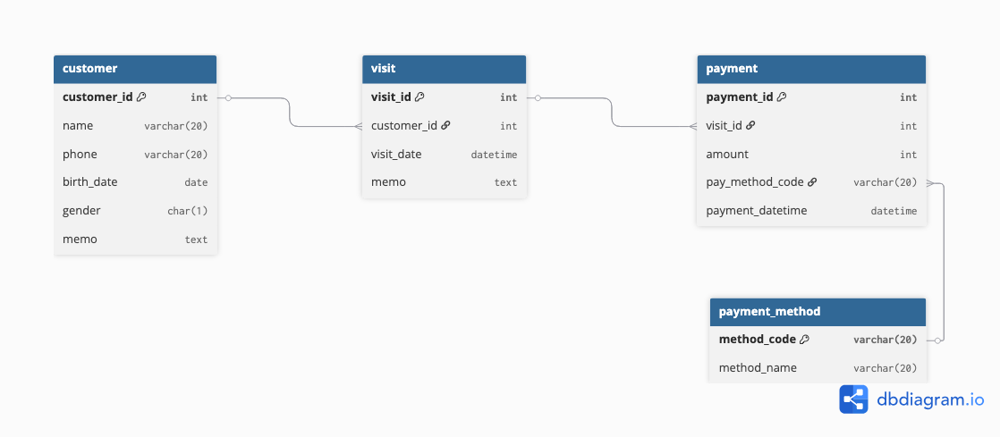

# CRM 시스템

간단한 고객 관계 관리(CRM) 시스템입니다. Flask를 사용하여 구현하였습니다.

## 주요 기능

### 1. 고객 관리
- **고객 등록**: 이름, 연락처, 생년월일, 성별, 메모
- **고객 목록 조회**: 전체 리스트, 검색(이름/번호/생일)
- **고객 정보 수정/삭제**: 입력값 수정, 삭제 전 확인 팝업
- **생일자 필터**: 이번달 생일 고객만 보기

### 2. 방문 기록
- **방문 등록**: 고객 선택 후 방문일, 메모 기록
- **고객별 방문 내역**: 고객 상세 페이지에서 확인
- **기간별 방문 기록**: 시작일/종료일로 필터링

### 3. 결제 관리
- **결제 등록**: 방문 기록 선택 후 결제 금액, 결제수단 기록
- **결제 내역 조회**: 전체 결제 내역 확인
- **고객별 결제 내역**: 고객 상세 페이지에서 확인

### 4. 통계 기능
- **전체 통계**: 총 고객수, 총 방문수, 총 매출, 평균 결제금액
- **고객별 통계**: 고객별 총 방문횟수, 총 결제금액, 평균 결제금액
- **월별 통계**: 월별 매출 및 방문 통계
- **대시보드**: 주요 지표를 한눈에 확인

##  데이터베이스 구조

### ERD (Entity Relationship Diagram)


### 테이블 구조

#### 1. customer (고객 테이블)
- `customer_id`: 고객 고유 ID (Primary Key, Auto Increment)
- `name`: 고객 이름 (VARCHAR(20), NOT NULL)
- `phone`: 연락처 (VARCHAR(20))
- `birth_date`: 생년월일 (DATE)
- `gender`: 성별 (CHAR(1))
- `memo`: 메모 (TEXT)

#### 2. visit (방문 테이블)
- `visit_id`: 방문 고유 ID (Primary Key, Auto Increment)
- `customer_id`: 고객 ID (Foreign Key → customer.customer_id)
- `visit_date`: 방문일시 (DATETIME, NOT NULL)
- `memo`: 방문 메모 (TEXT)

#### 3. payment_method (결제수단 코드 테이블)
- `method_code`: 결제수단 코드 (Primary Key, VARCHAR(20))
- `method_name`: 결제수단 이름 (VARCHAR(20), NOT NULL)

#### 4. payment (결제 테이블)
- `payment_id`: 결제 고유 ID (Primary Key, Auto Increment)
- `visit_id`: 방문 ID (Foreign Key → visit.visit_id)
- `amount`: 결제 금액 (INT, NOT NULL, >= 0)
- `payment_method_code`: 결제수단 코드 (Foreign Key → payment_method.method_code)
- `payment_datetime`: 결제일시 (DATETIME, NOT NULL)

### 관계
- **customer ↔ visit**: 1:N 관계 (한 고객이 여러 번 방문 가능)
- **visit ↔ payment**: 1:N 관계 (한 방문에 여러 결제 가능)
- **payment_method ↔ payment**: 1:N 관계 (하나의 결제수단으로 여러 결제 가능)

## 설치 및 실행

### 1. 환경 설정
```bash
# 가상환경 생성 및 활성화
python -m venv py-crm-venv
py-crm-venv\Scripts\activate    # Windows
source py-crm-venv/bin/activate # Linux/Mac

# 필요한 패키지 설치
pip install -r requirements.txt
```

### 2. 데이터베이스 설정
1. MySQL 데이터베이스 생성
2. `app/config.py` 파일에서 데이터베이스 연결 정보 설정
3. `.env` 파일 생성:
```bash
DB_HOST=localhost
DB_PORT=3306
DB_USER=root
DB_PASSWORD=your_password
DB_NAME=crm_db
```

### 3. 데이터베이스 초기화
```bash
# SQL 스크립트 실행
mysql -u root -p crm_db < scripts/sql/crm_ddl.sql
mysql -u root -p crm_db < scripts/sql/init_payment_method.sql
```

### 4. 웹 애플리케이션 실행
```bash
python main.py
```
브라우저에서 `http://localhost:5000`으로 접속하여 사용할 수 있습니다.

## 페이지 구성

### 메인 페이지
- **대시보드**: 전체 통계, 이번달 생일 고객, 최근 방문 기록

### 고객 관리
- **고객 목록**: 검색, 필터링
- **고객 등록**: 새 고객 정보 입력
- **고객 상세**: 고객 정보, 통계, 방문 기록, 결제 내역
- **고객 수정**: 기존 고객 정보 수정

### 방문 기록
- **방문 목록**: 전체 방문 기록, 기간별 필터링
- **방문 등록**: 고객 선택 후 방문 정보 입력
- **방문 수정**: 방문 수정

### 결제 관리
- **결제 목록**: 전체 결제 내역
- **결제 등록**: 방문 기록 선택 후 결제 정보 입력

### 통계
- **통계 대시보드**: 전체 통계, 이번달 통계, 월별 통계
- **고객별 통계**: 각 고객의 상세 통계 정보

## 기술 스택
- **Backend**: Python Flask
- **Frontend**: HTML, CSS(Bootstrap 5), JavaScript
- **Template Engine**: Jinja2
- **Database**: MySQL
- **ORM**: mysql-connector-python (Native SQL)

## 📁 파일 구조
```
py-crm-lite/
├── app/                    # 핵심 애플리케이션 모듈
│   ├── config.py           # 설정 관리 (데이터베이스 연결 정보)
│   ├── database.py         # 데이터베이스 연결 및 쿼리 실행
│   ├── customer.py         # 고객 관리 모듈
│   ├── visit.py            # 방문 관리 모듈
│   ├── payment.py          # 결제 관리 모듈
│   └── stats.py            # 통계 관리 모듈
├── apis/                  
│   └── __init__.py
├── tests/                  # 테스트 코드
│   ├── conftest.py         # pytest 설정
│   ├── test_customer.py    # 고객 모듈 테스트
│   ├── test_visit.py       # 방문 모듈 테스트
│   ├── test_payment.py     # 결제 모듈 테스트
│   └── test_stats.py       # 통계 모듈 테스트
├── scripts/                # 데이터베이스 스크립트
│   └── sql/
│       ├── crm_ddl.sql     # 테이블 생성 스크립트
│       └── init_payment_method.sql  # 결제수단 초기 데이터
├── templates/              # HTML 템플릿 (Jinja2 사용)
│   ├── base.html           # 공통 레이아웃 템플릿
│   ├── dashboard.html      # 대시보드 메인 페이지 템플릿
│   ├── customers/          # 고객 관련 화면 템플릿
│   │   ├── detail.html     # 고객 상세 페이지
│   │   ├── edit.html       # 고객 수정 페이지
│   │   ├── list.html       # 고객 목록 페이지
│   │   └── new.html        # 고객 등록 페이지
│   ├── payments/           # 결제 관련 화면 템플릿
│   │   ├── list.html       # 결제 목록 페이지
│   │   └── new.html        # 결제 등록 페이지
│   ├── stats/              # 통계 관련 화면 템플릿
│   │   ├── customers.html  # 고객별 통계 페이지
│   │   └── dashboard.html  # 통계 대시보드 페이지
│   └── visits/             # 방문 관련 화면 템플릿
│       ├── edit.html       # 방문 수정 페이지
│       ├── list.html       # 방문 목록 페이지
│       └── new.html        # 방문 등록 페이지
├── docs/                   # 문서
│   └── crm_erd.png         # 데이터베이스 ERD 이미지
├── py-crm-venv/            # Python 가상환경
├── main.py                 # 메인 실행 파일 (Flask 앱)
├── main copy.py            
├── requirements.txt        # 의존성 패키지 목록
├── pytest.ini              # pytest 설정 파일
├── .env                    # 환경 변수 (데이터베이스 연결 정보)
├── .gitignore             
└── README.md               # 프로젝트 문서
```

