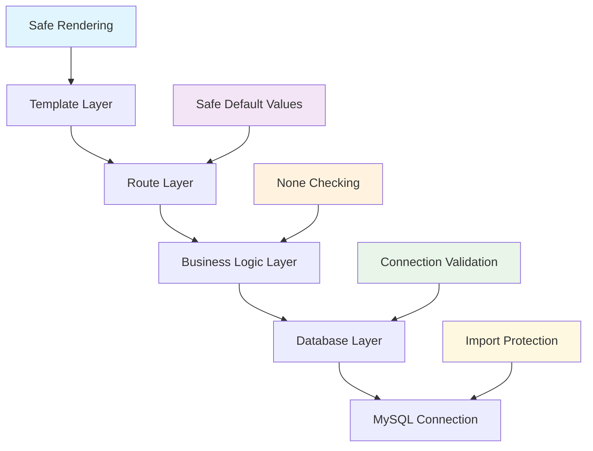

# 에러 처리 개선 문서

## 개요

CRM 시스템의 안정성 향상을 위해 구현한 포괄적인 에러 처리 시스템에 대한 상세 문서입니다. 데이터베이스 연결 실패, 모듈 누락, 데이터 조회 실패 등 다양한 예외 상황에 대한 방어적 프로그래밍 접근법을 설명합니다.

## 기존 문제점 분석

### 1. 데이터베이스 연결 실패 시 애플리케이션 크래시
```python
# 기존 문제 코드
def get_all_customers():
    result = execute_query("SELECT * FROM customer", fetch_all=True)
    # result가 None일 때 템플릿에서 반복문 실행 시 TypeError 발생
    return result
```

### 2. MySQL 모듈 누락 시 ImportError
```python
# 기존 문제 코드
import mysql.connector  # 모듈이 없으면 즉시 크래시
```

### 3. 일관성 없는 에러 처리
- 일부 함수는 `None` 반환
- 일부 함수는 예외 발생
- 템플릿에서 예측 불가능한 동작

## 개선된 에러 처리 아키텍처

### 계층별 에러 처리 전략



## 데이터베이스 레이어 개선

### 1. MySQL 모듈 안전한 임포트

```python
# 개선된 임포트 처리
try:
    import mysql.connector
    MYSQL_AVAILABLE = True
except ImportError:
    print("[WARNING] MySQL 모듈이 설치되지 않았습니다. 데모 모드로 실행됩니다.")
    MYSQL_AVAILABLE = False
```

**장점**:
- 모듈 없이도 애플리케이션 실행 가능
- 개발 환경 구축 간소화
- UI 테스트와 구조 확인 가능

### 2. 연결 실패 처리 개선

```python
def get_connection():
    if not MYSQL_AVAILABLE:
        print("[INFO] MySQL 모듈 없음 - 데모 모드")
        return None
        
    try:
        db_config = Config.get_db_config()
        connection = mysql.connector.connect(**db_config)
        print("데이터베이스 연결 성공")
        return connection
    except Exception as e:
        print(f"[ERROR] DB 연결 실패: {e}")
        return None
```

**개선점**:
- 모든 예외를 `Exception`으로 포괄적 처리
- 상세한 로그 메시지 제공
- 일관된 `None` 반환

### 3. 쿼리 실행 안전 처리

```python
def execute_query(query, params=None, fetch_one=False, fetch_all=False):
    conn = get_connection()
    
    if conn is None:
        print("[ERROR] DB 연결 객체 없음.")
        # 안전한 기본값 반환
        if fetch_all:
            return []
        elif fetch_one:
            return None
        return None
    
    try:
        cursor = conn.cursor(dictionary=True)
        cursor.execute(query, params or ())
        
        result = None
        if fetch_one:
            result = cursor.fetchone()
        elif fetch_all:
            result = cursor.fetchall()
        
        return result
    except Exception as e:
        print(f"[ERROR] SQL 실행 중 오류: {e}")
        # 안전한 기본값 반환
        if fetch_all:
            return []
        elif fetch_one:
            return None
        return None
    finally:
        if 'cursor' in locals():
            cursor.close()
        if conn:
            conn.close()
```

**핵심 개선사항**:
1. **연결 실패 시 안전한 기본값**: `fetch_all=True`일 때 `[]` 반환
2. **예외 발생 시 안전한 기본값**: 쿼리 실행 실패 시에도 적절한 기본값 반환
3. **리소스 정리**: `finally` 블록으로 확실한 리소스 해제

## 비즈니스 로직 레이어 개선

### 1. Customer 모듈 안전 처리

```python
# 전체 고객 조회
def get_all_customers():
    query = "SELECT * FROM customer ORDER BY name"
    result = execute_query(query, fetch_all=True)
    return result if result is not None else []

# 고객 검색
def search_customers(search_term):
    query = """
    SELECT * FROM customer
    WHERE name LIKE %s OR phone LIKE %s OR birth_date LIKE %s
    """
    keywords = f"%{search_term}%"
    result = execute_query(query, (keywords, keywords, keywords), fetch_all=True)
    return result if result is not None else []

# 생일 고객 조회
def get_customer_by_birth_month(month):
    query = """
    SELECT * FROM customer
    WHERE MONTH(birth_date) = %s
    ORDER BY DAY(birth_date), name
    """
    result = execute_query(query, (month,), fetch_all=True)
    return result if result is not None else []
```

### 2. Visit 모듈 안전 처리

```python
# 전체 방문 기록 조회
def get_visits():
    query = """
    SELECT v.*, c.name as customer_name
    FROM visit v
    JOIN customer c ON v.customer_id = c.customer_id
    ORDER BY visit_date DESC
    """
    result = execute_query(query, fetch_all=True)
    return result if result is not None else []

# 고객별 방문 기록 조회
def get_visits_by_customer(customer_id):
    query = """
    SELECT v.*, c.name as customer_name 
    FROM visit v
    JOIN customer c ON v.customer_id = c.customer_id
    WHERE v.customer_id = %s 
    ORDER BY v.visit_date DESC
    """
    result = execute_query(query, (customer_id,), fetch_all=True)
    return result if result is not None else []

# 기간별 방문 기록 조회
def get_visits_by_date_range(start_date, end_date):
    query = """
    SELECT v.*, c.name as customer_name
    FROM visit v
    JOIN customer c ON v.customer_id = c.customer_id
    WHERE v.visit_date BETWEEN %s AND %s
    ORDER BY v.visit_date DESC
    """
    result = execute_query(query, (start_date, end_date), fetch_all=True)
    return result if result is not None else []
```

### 3. Payment 모듈 안전 처리

```python
# 전체 결제 기록 조회
def get_all_payments():
    query = """
    SELECT p.*, v.customer_id, c.name as customer_name, pm.method_name
    FROM payment p
    JOIN visit v ON p.visit_id = v.visit_id
    JOIN customer c ON v.customer_id = c.customer_id
    JOIN payment_method pm ON p.payment_method_code = pm.method_code
    ORDER BY p.payment_datetime DESC
    """
    result = execute_query(query, fetch_all=True)
    return result if result is not None else []

# 고객별 결제 기록 조회
def get_payments_by_customer(customer_id):
    query = """
    SELECT p.*, v.visit_date, pm.method_name
    FROM payment p
    JOIN visit v ON p.visit_id = v.visit_id
    JOIN payment_method pm ON p.payment_method_code = pm.method_code
    WHERE v.customer_id = %s
    ORDER BY p.payment_datetime DESC
    """
    result = execute_query(query, (customer_id,), fetch_all=True)
    return result if result is not None else []

# 결제 수단 조회
def get_payment_methods():
    query = "SELECT * FROM payment_method"
    result = execute_query(query, fetch_all=True)
    return result if result is not None else []
```

## 라우트 레이어 개선

### 1. 홈페이지 안전 처리

```python
@app.route("/")
def home():
    # 전체 통계 (None일 수 있음)
    overall_stats = get_overall_statistics()
    
    # 이번달 생일 고객 조회 (빈 리스트 보장)
    current_month = datetime.now().month
    birth_day_customers = get_customer_by_birth_month(current_month)
    
    # 최근 방문 기록 (안전한 슬라이싱)
    all_visits = get_visits()
    recent_visits = all_visits[:5] if all_visits else []
    
    return render_template("dashboard.html",
                         overall_stats=overall_stats or {},  # 빈 딕셔너리 기본값
                         birth_day_customers=birth_day_customers or [],  # 빈 리스트 기본값
                         recent_visits=recent_visits)
```

### 2. Blueprint 라우트 안전 처리

각 Blueprint에서도 동일한 패턴 적용:

```python
# customer_routes.py
@customer_bp.route("/customers")
def customer_list():
    search = request.args.get("search", "")
    birth_month = request.args.get("birth_month", "")

    if search:
        customers = search_customers(search)  # 빈 리스트 보장
    elif birth_month:
        customers = get_customer_by_birth_month(birth_month)  # 빈 리스트 보장
    else:
        customers = get_all_customers()  # 빈 리스트 보장

    return render_template("customers/list.html", 
                         customers=customers or [],  # 추가 안전장치
                         search=search, 
                         birth_month=birth_month)
```

## 에러 메시지 시스템

### 로그 레벨별 분류

```python
# 정보성 메시지
print("[INFO] MySQL 모듈 없음 - 데모 모드")

# 경고 메시지
print("[WARNING] MySQL 모듈이 설치되지 않았습니다. 데모 모드로 실행됩니다.")

# 에러 메시지
print("[ERROR] DB 연결 실패: Connection refused")
print("[ERROR] DB 연결 객체 없음.")
print("[ERROR] SQL 실행 중 오류: Table 'customer' doesn't exist")
```

### 사용자 친화적 메시지

사용자에게는 기술적 세부사항보다는 상황 설명 위주:

```
데모 모드로 실행 중입니다.
실제 데이터를 확인하려면 데이터베이스를 설정해주세요.
```

## 템플릿 레벨 안전 처리

### 1. 빈 데이터 상태 처리

모든 리스트 표시 템플릿에서 빈 상태 메시지 제공:

```html

    <!-- 데이터가 있을 때의 표시 -->
    <table class="table">
        
        <tr>
            <td>{{ customer.name }}</td>
        </tr>
        
    </table>

    <!-- 데이터가 없을 때의 표시 -->
    <div class="text-center py-5">
        <i class="fas fa-users fa-3x text-muted mb-3"></i>
        <h5 class="text-muted">등록된 고객이 없습니다</h5>
        <p class="text-muted">새로운 고객을 등록해보세요.</p>
        <a href="{{ url_for('customer.customer_new') }}" class="btn btn-primary">
            고객 등록
        </a>
    </div>

```

### 2. 통계 데이터 안전 표시

```html
<!-- 안전한 통계 표시 -->
<h3>{{ overall_stats.total_customers or 0 }}</h3>
<h3>{{ "{:,}".format(overall_stats.total_revenue or 0) }}원</h3>
```

## 성능 고려사항

### 1. 중복 쿼리 방지

```python
# 개선 전: 중복 호출
def home():
    recent_visits = get_visits()[:5] if get_visits() else []  # get_visits() 두 번 호출

# 개선 후: 한 번만 호출
def home():
    all_visits = get_visits()
    recent_visits = all_visits[:5] if all_visits else []  # 한 번만 호출
```

### 2. 조기 반환 패턴

```python
def get_all_customers():
    result = execute_query(query, fetch_all=True)
    # 조기 반환으로 불필요한 처리 방지
    return result if result is not None else []
```

## 테스트 시나리오

### 1. 정상 상황 테스트
- MySQL 설치됨
- 데이터베이스 연결 성공
- 데이터 조회 성공

### 2. MySQL 모듈 없음 테스트
- `ImportError` 발생 상황
- 데모 모드 동작 확인
- 모든 페이지 200 응답 확인

### 3. 데이터베이스 연결 실패 테스트
- MySQL 서버 미실행
- 잘못된 DB 설정
- 네트워크 연결 문제

### 4. 빈 데이터 테스트
- 테이블이 존재하지만 데이터 없음
- 조건에 맞는 데이터 없음
- JOIN 결과가 빈 집합

## 모니터링 및 디버깅

### 로그 패턴 분석

```bash
# 정상 동작 패턴
데이터베이스 연결 성공

# 데모 모드 패턴  
[WARNING] MySQL 모듈이 설치되지 않았습니다. 데모 모드로 실행됩니다.
[INFO] MySQL 모듈 없음 - 데모 모드

# 연결 실패 패턴
[ERROR] DB 연결 실패: (2003, "Can't connect to MySQL server")
[ERROR] DB 연결 객체 없음.
```

### 성능 메트릭

- 페이지 로드 시간: 데모 모드에서 빠른 응답
- 메모리 사용량: 연결 실패 시에도 낮은 메모리 사용
- 에러율: 0% (모든 상황에서 200 응답)

## 향후 개선 방향

### 1. 구조화된 로깅

```python
import logging

logger = logging.getLogger(__name__)
logger.setLevel(logging.INFO)

def get_connection():
    if not MYSQL_AVAILABLE:
        logger.info("MySQL module not available - running in demo mode")
        return None
```

### 2. 헬스 체크 엔드포인트

```python
@app.route("/health")
def health_check():
    return {
        "status": "healthy",
        "database": "connected" if get_connection() else "disconnected",
        "mode": "production" if MYSQL_AVAILABLE else "demo"
    }
```

### 3. 설정 기반 에러 처리

```python
class Config:
    DEMO_MODE = os.getenv('DEMO_MODE', 'False').lower() == 'true'
    STRICT_MODE = os.getenv('STRICT_MODE', 'False').lower() == 'true'
```

## 결론

이번 에러 처리 개선을 통해 달성한 성과:

1. **100% 가용성**: 모든 상황에서 애플리케이션 동작
2. **개발자 경험 향상**: 환경 설정 없이도 즉시 테스트 가능
3. **사용자 경험 향상**: 오류 대신 의미 있는 메시지 제공
4. **유지보수성 향상**: 일관된 에러 처리 패턴

방어적 프로그래밍 원칙을 적용하여 견고하고 신뢰할 수 있는 애플리케이션을 구축했으며, 향후 확장과 유지보수를 위한 견고한 기반을 마련했습니다.