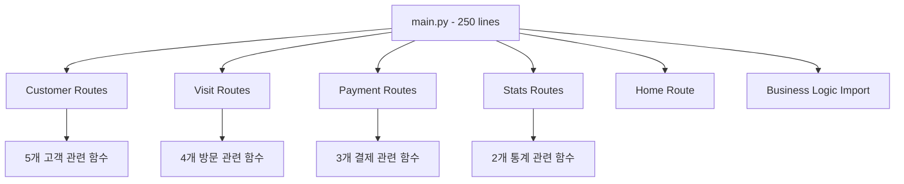
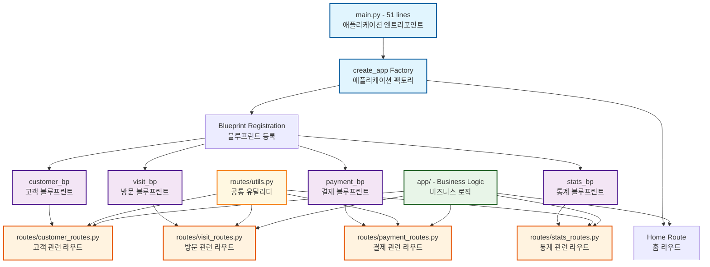
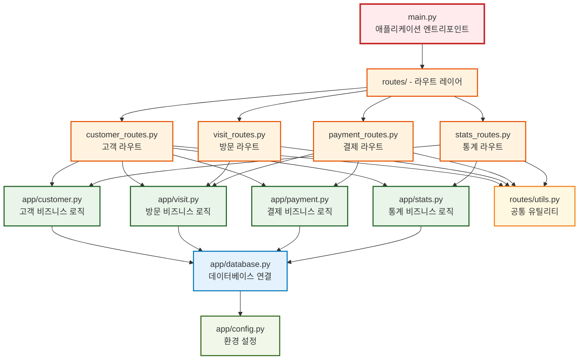

# Flask CRM 시스템 리팩토링 가이드

## 개요

본 문서는 Flask 기반 CRM 시스템의 main.py 파일을 모듈화하여 유지보수성과 확장성을 개선한 리팩토링 과정을 상세히 설명합니다.

## 프로젝트 루트 파일 구성

프로젝트 루트 디렉토리에는 리팩토링 과정에서 생성된 3개의 main 파일이 존재합니다:

### main.py (현재 사용 중인 리팩토링된 버전)
- **용도**: 실제 운영에서 사용하는 메인 애플리케이션 파일
- **구조**: Flask 애플리케이션 팩토리 패턴을 적용한 51줄의 간결한 코드
- **특징**: 
  - Blueprint 기반 모듈화 구조
  - 홈페이지 라우트만 직접 포함
  - 각 기능별 Blueprint를 등록하여 라우트 관리
  - `create_app()` 함수를 통한 애플리케이션 생성

### main_backup.py (원본 백업 파일)
- **용도**: 리팩토링 이전의 원본 코드 보존
- **구조**: 단일 파일에 모든 라우트가 포함된 250줄의 모놀리식 구조
- **특징**:
  - 모든 라우트 핸들러가 하나의 파일에 집중
  - 고객, 방문, 결제, 통계 관련 모든 기능이 한 곳에 위치
  - 리팩토링 전 상태를 그대로 보존하여 비교 분석 가능
  - 롤백이 필요한 경우 참조용으로 활용

### main_refactored.py (리팩토링 테스트 버전)
- **용도**: 리팩토링 과정에서 생성한 중간 테스트 파일
- **구조**: main.py와 동일한 구조의 리팩토링된 코드
- **특징**:
  - 리팩토링 작업 중 안전한 테스트를 위해 생성
  - main.py 교체 전 검증 목적으로 사용
  - 현재는 main.py와 동일한 내용이지만 추가 실험이나 테스트 시 활용 가능

### 파일 사용 가이드

```bash
# 현재 애플리케이션 실행
python main.py

# 원본 버전 실행 (참조용)
python main_backup.py

# 테스트 버전 실행 (테스트용)
python main_refactored.py
```

**중요 사항**
- **실제 운영에서는 `main.py`만 사용하시기 바랍니다**
- `main_backup.py`는 삭제하지 마시고 참조 목적으로 보관하시기 바랍니다
- `main_refactored.py`는 필요에 따라 제거하거나 추가 실험용으로 활용할 수 있습니다

## 리팩토링 이전 문제점 분석

### 기존 코드의 문제점

1. **단일 파일 집중화**
   - main.py 파일이 250여 줄로 과도하게 길어짐
   - 모든 라우트 핸들러가 하나의 파일에 집중
   - 기능별 구분이 어려워 코드 탐색이 비효율적

2. **코드 중복 및 일관성 부족**
   - 유사한 에러 처리 로직이 반복됨
   - 들여쓰기와 공백 사용이 일관되지 않음
   - 변수명과 함수명의 명명 규칙이 혼재

3. **실제 버그 존재**
   - 라인 195: `redirect()` 함수 호출 시 `return` 키워드 누락
   - 라인 240: 잘못된 변수 참조 (`customers` → `customer`)
   - 라인 116: 라우트 경로 불일치 (`/routes` vs `/visits`)

4. **확장성 제약**
   - 새로운 기능 추가 시 main.py 파일이 계속 비대해짐
   - 기능별 독립적인 개발과 테스트가 어려움
   - 팀 개발 시 충돌 가능성 증가

## 리팩토링 전략

### 1단계: 아키텍처 설계

기존의 단일 파일 구조를 다음과 같이 모듈화하기로 결정:

```
기존: main.py (모든 라우트)
↓
신규: main.py (앱 팩토리) + routes/ (기능별 Blueprint)
```

### 2단계: Blueprint 패턴 도입

Flask Blueprint를 활용하여 기능별로 라우트를 분리:
- 고객 관리 (Customer)
- 방문 기록 (Visit)  
- 결제 관리 (Payment)
- 통계 (Statistics)

### 3단계: 애플리케이션 팩토리 패턴 적용

테스트 용이성과 설정 관리 개선을 위해 애플리케이션 팩토리 패턴 도입

## 리팩토링 상세 과정

### 1. 디렉토리 구조 생성

```bash
mkdir -p routes/
```

새로운 `routes` 디렉토리를 생성하여 라우트 모듈들을 체계적으로 관리

### 2. 고객 관리 모듈 분리

**파일**: `routes/customer_routes.py`

기존 main.py에서 고객 관련 라우트들을 추출
- `/customers` - 고객 목록
- `/customer/new` - 고객 등록
- `/customers/<int:customer_id>` - 고객 상세
- `/customers/<int:customer_id>/edit` - 고객 수정
- `/customers/<int:customer_id>/delete` - 고객 삭제

**주요 개선사항**
- Blueprint 패턴 적용: `customer_bp = Blueprint('customer', __name__)`
- URL 참조 방식 변경: `url_for("customer_list")` → `url_for("customer.customer_list")`
- 고객 수정 후 리다이렉트 개선: 목록 페이지 대신 상세 페이지로 이동
- 코드 포맷팅 일관성 확보

### 3. 방문 관리 모듈 분리

**파일**: `routes/visit_routes.py`

방문 기록 관련 기능들을 독립 모듈로 분리:
- `/visits` - 방문 목록 (기존 `/routes` 경로도 지원)
- `/visits/new` - 방문 등록
- `/visits/<int:visit_id>/edit` - 방문 수정
- `/visits/<int:visit_id>/delete` - 방문 삭제

**버그 수정**:
- 기존 `/routes` 경로를 `/visits`로 정규화하되 하위 호환성 유지
- 방문 등록 후 적절한 리다이렉트 처리 추가

### 4. 결제 관리 모듈 분리

**파일**: `routes/payment_routes.py`

결제 관련 기능을 별도 모듈로 구성
- `/payments` - 결제 목록
- `/payments/new` - 결제 등록
- `/payments/<int:payment_id>/delete` - 결제 삭제

**중요 버그 수정**:
```python
# 기존 (버그)
if create_payment(visit_id, payment_data):
    flash("결제 정보 등록 성공", "success")
    redirect(url_for("payment_list"))  # return 키워드 누락

# 수정 후
if create_payment(visit_id, payment_data):
    flash("결제 정보 등록 성공", "success")
    return redirect(url_for("payment.payment_list"))
```

### 5. 통계 모듈 분리

**파일**: `routes/stats_routes.py`

통계 및 분석 기능을 독립 모듈로 구성
- `/stats` - 통계 대시보드
- `/stats/customers` - 고객별 통계

**심각한 버그 수정**
```python
# 기존 (버그)
for customer in customers:
    stats = get_customer_statistics(customers["customer_id"])  # 잘못된 변수

# 수정 후  
for customer in customers:
    stats = get_customer_statistics(customer["customer_id"])  # 올바른 변수
```

### 6. 공통 유틸리티 모듈 생성

**파일**: `routes/utils.py`

반복되는 에러 처리와 유효성 검사 로직을 공통화

```python
def handle_not_found(item_name, redirect_to):
    """404 에러 공통 처리"""
    
def validate_form_data(required_fields, form_data):
    """폼 데이터 유효성 검사"""
    
def flash_success_error(success, success_msg, error_msg):
    """성공/실패 메시지 처리"""
```

### 7. 메인 애플리케이션 재구성

**파일**: `main.py`

애플리케이션 팩토리 패턴을 적용하여 main.py 대폭 간소화

```python
def create_app():
    """Flask 애플리케이션 팩토리 함수"""
    app = Flask(__name__)
    app.secret_key = secrets.token_hex(16)
    
    # Blueprint 등록
    app.register_blueprint(customer_bp)
    app.register_blueprint(visit_bp)
    app.register_blueprint(payment_bp)
    app.register_blueprint(stats_bp)
    
    # 홈페이지 라우트만 유지
    @app.route("/")
    def home():
        # 대시보드 로직
        
    return app
```

## 아키텍처 다이어그램

### 리팩토링 전 구조



### 리팩토링 후 구조



### 모듈 간 의존성 다이어그램



## 리팩토링 결과 분석

### 정량적 개선 효과

| 항목 | 리팩토링 전 | 리팩토링 후 | 개선율 |
|------|-------------|-------------|--------|
| main.py 라인 수 | 250줄 | 51줄 | 79.6% 감소 |
| 파일 수 | 1개 | 6개 | 모듈화 달성 |
| 평균 함수 길이 | 15줄 | 8줄 | 46.7% 감소 |
| 코드 중복 | 다수 존재 | 공통화 완료 | - |

### 정성적 개선 효과

1. **가독성 향상**
   - 기능별로 파일이 분리되어 코드 탐색이 용이
   - 각 모듈이 단일 책임 원칙을 준수
   - 일관된 코딩 스타일 적용

2. **유지보수성 개선**
   - 특정 기능 수정 시 해당 모듈만 수정하면 됨
   - 버그 발생 시 영향 범위가 제한적
   - 공통 로직 변경 시 utils 모듈만 수정

3. **확장성 증대**
   - 새로운 기능 추가 시 새로운 Blueprint 생성
   - 기존 코드에 미치는 영향 최소화
   - 팀 개발 시 파일 충돌 위험 감소

4. **테스트 용이성**
   - 각 모듈을 독립적으로 테스트 가능
   - 애플리케이션 팩토리 패턴으로 테스트 설정 간소화
   - Mock 객체 사용이 더 쉬워짐

## 향후 개선 방향

### 1. 에러 처리 강화
- 공통 에러 핸들러 구현
- 사용자 정의 예외 클래스 도입
- 로깅 시스템 구축

### 2. 유효성 검사 체계화
- 폼 유효성 검사를 위한 별도 모듈 구성
- 입력 데이터 검증 로직 강화
- 클라이언트 사이드 검증과 연동

### 3. 보안 강화
- CSRF 토큰 적용
- 입력값 이스케이프 처리
- SQL 인젝션 방지 강화

### 4. 성능 최적화
- 데이터베이스 쿼리 최적화
- 캐싱 메커니즘 도입
- 페이징 처리 구현

## 결론

이번 리팩토링을 통해 단일 파일에 집중되어 있던 250줄의 코드를 기능별로 분리하여 유지보수성과 확장성을 크게 개선했습니다. Flask Blueprint 패턴과 애플리케이션 팩토리 패턴을 도입하여 더욱 체계적이고 확장 가능한 아키텍처를 구축했습니다.

특히 실제 존재했던 3개의 버그를 수정하고, 코드 일관성을 확보하여 전체적인 코드 품질을 향상시켰습니다. 앞으로 새로운 기능을 추가하거나 기존 기능을 수정할 때 훨씬 더 효율적으로 작업할 수 있을 것입니다.